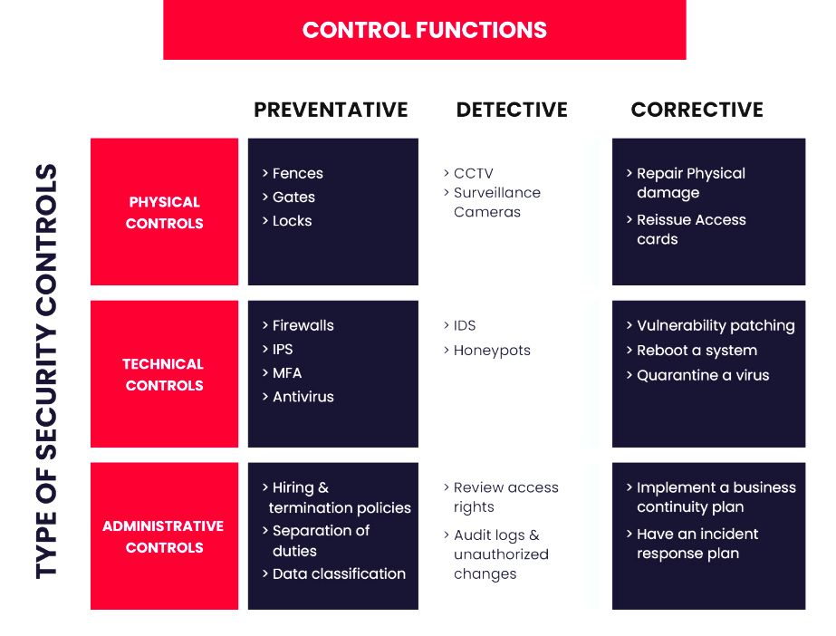

# Security Controls ในชีวิตประจำวัน

 

+ ภาพนี้เป็นอีเมลแจ้งเตือนการลงชื่อเข้าใช้งานบัญชี Google ครั้งใหม่ ซึ่งหากเทียบกับตาราง Security Controls ภาพนี้จัดอยู่ในหมวด Technical Controls (การควบคุมทางเทคนิค) โดยทำหน้าที่หลักเป็น Detective (การตรวจจับ)

# เหตุผลที่จัดอยู่ในหมวดนี้เป็นเพราะ
 + เป็น Technical Control (การควบคุมทางเทคนิค) 
     + ใช้ระบบซอฟต์แวร์ทำงาน: เป็นการใช้ระบบอัตโนมัติของ Google ในการตรวจสอบลายนิ้วมือดิจิทัล (Digital Footprint) เช่น อุปกรณ์ที่ใช้, ที่อยู่ IP, หรือเบราว์เซอร์ เพื่อระบุว่าเป็นการเข้าใช้งานรูปแบบใหม่
     + ไม่ใช่คนมานั่งเฝ้า: ระบบคอมพิวเตอร์เป็นตัวจัดการกระบวนการนี้ทั้งหมด ไม่ใช่ระเบียบปฏิบัติที่ใช้คนเดินตรวจ
 + ทำหน้าที่เป็น Detective Function (การตรวจจับ)
     + แจ้งเตือนเมื่อเกิดเหตุ: ระบบไม่ได้ขวางการล็อกอินในทันที (นั่นจะเป็น Preventative) แต่จะ "ตรวจพบ" และส่งสัญญาณเตือนให้เจ้าของบัญชีรู้ว่ามีกิจกรรมเกิดขึ้น
     + สร้าง Audit Trail: อีเมลฉบับนี้ทำหน้าที่เหมือนบันทึกการตรวจสอบ (Audit log) เพื่อให้เราตรวจสอบย้อนหลังได้ว่ากิจกรรมนี้เราเป็นคนทำเองหรือไม่
 + สามารถมองเป็น Corrective ได้ด้วย
     + ในตัวอีเมลจะมีปุ่ม "ตรวจสอบกิจกรรม" ซึ่งหากคลิกเข้าไปแล้วแจ้งว่า "ไม่ใช่ฉัน" ระบบจะเข้าสู่โหมด Corrective (การแก้ไข) ทันที เช่น:
     + การสั่ง Log out ออกจากอุปกรณ์นั้น
     + การบังคับให้เปลี่ยนรหัสผ่านใหม่เพื่อกู้คืนความปลอดภัย

# สรุป
 + ตัวอีเมลแจ้งเตือนคือ Technical + Detective 
 + แต่กระบวนการหลังจากที่กดปุ่มเข้าไปจัดการ จะกลายเป็น Technical + Correctiv

