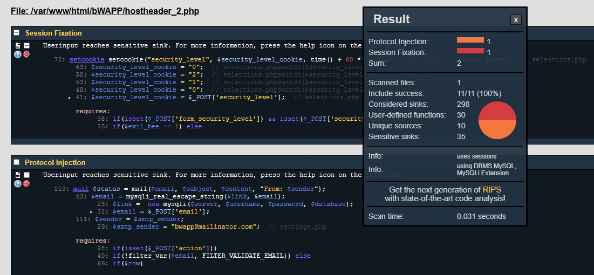
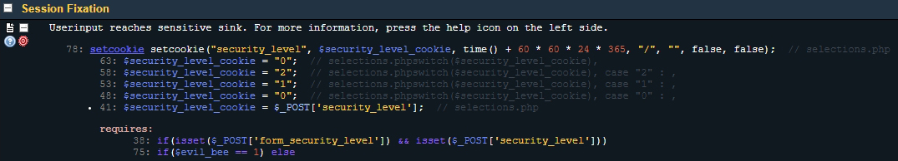
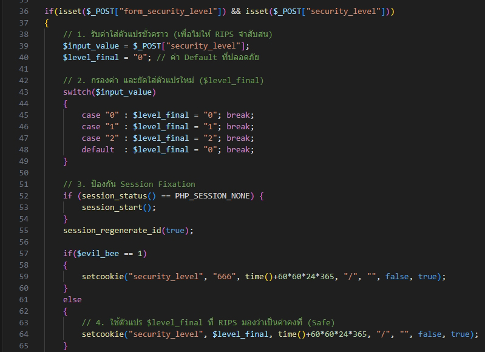
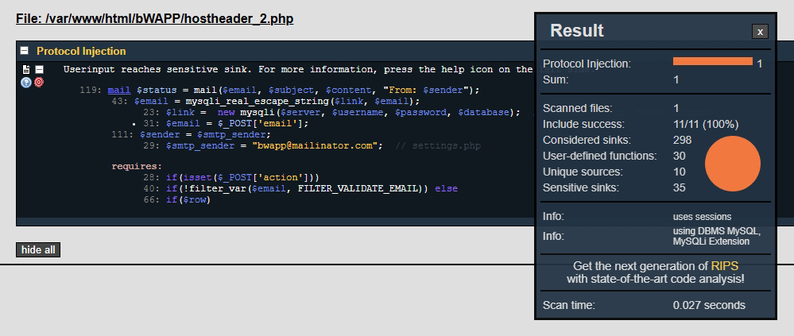
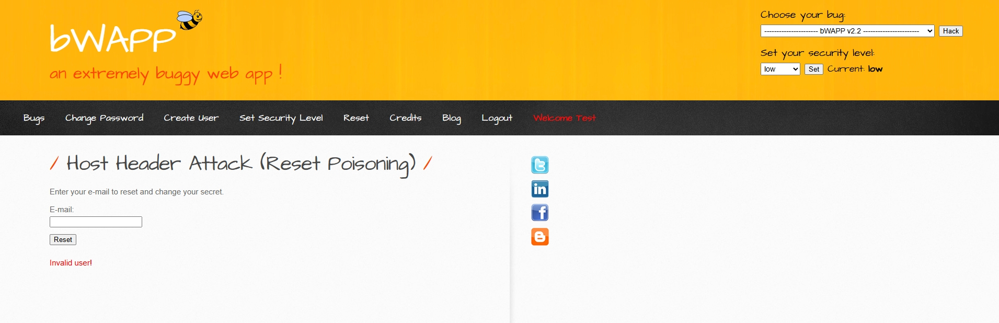
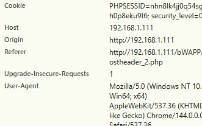
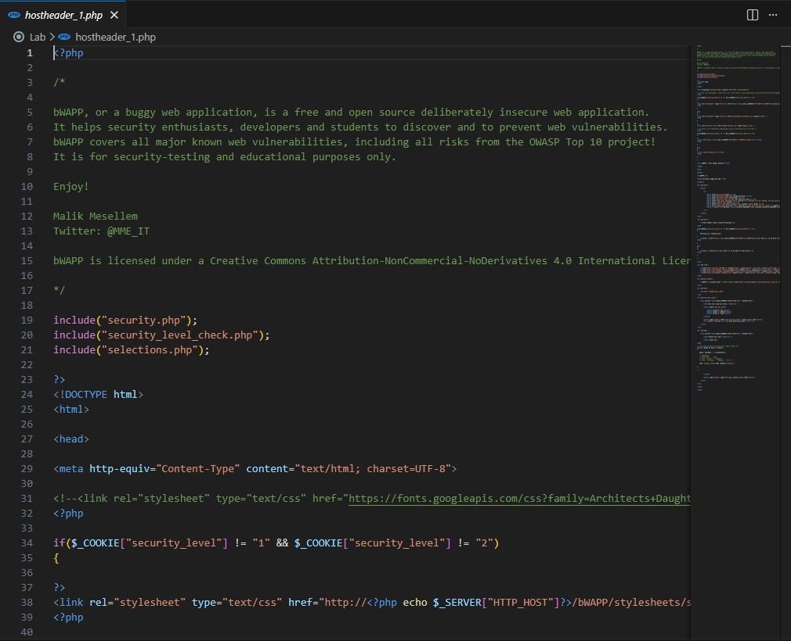
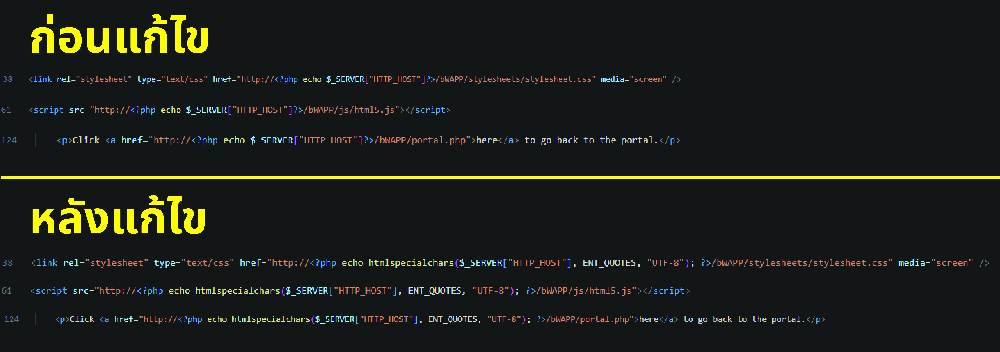
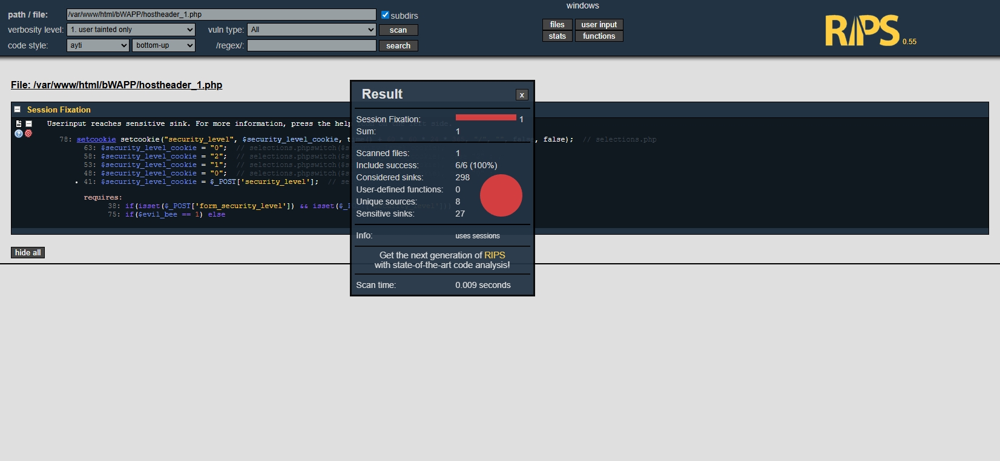
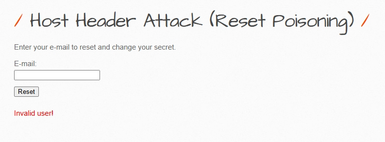

# การจัดการช่องโหว่  Host Header Attack (Reset Poisoning)
---------------------------------------------------------------------
# 1.เลือกช่องโหว่ Host Header Attack (Reset Poisoning)


# 2.เปิดหน้า RIPS ใน Browser 
+ ใส่ Path: /var/www/html/bWAPP/hostheader_1.php



# 3.กด Scan 
+ RIPS จะแจ้งเตือน ช่องโหว 4 ตัวที่เจอ Cross-Site Scripting: 3 Session Fixation: 1



# 4. เราจะแก้ปัญหา Cross-Site Scripting 
+ วิเคราะห์สาเหตุของปัญหาจากผลสแกน RIPS ที่คุณได้รับ ระบบแจ้งเตือนว่าข้อมูลจาก ``` $_SERVER['HTTP_HOST'] ``` ถูกส่งไปยังคำสั่ง echo โดยตรง ซึ่งในบริบทของความปลอดภัย ข้อมูลใน Host Header ถือเป็นข้อมูลที่ผู้ใช้ (หรือผู้โจมตี) สามารถปรับเปลี่ยนได้เองผ่านทาง HTTP Request
    + ช่องโหว่ (Vulnerability): การนำข้อมูลที่ "สกปรก" (Tainted data) ไปแสดงผลบนหน้าเว็บโดยไม่มีการตรวจสอบหรือเข้ารหัส
    + ผลกระทบ: ผู้โจมตีสามารถฝังโค้ด JavaScript เช่น ``` <script>alert('XSS')</script> ``` ลงใน Host Header เพื่อให้รันในเบราว์เซอร์ของผู้อื่นได้



# 5.ขั้นตอนการแก้ไขโค้ด (The Patch) 
+ เพื่อปิดช่องโหว่นี้อย่างสมบูรณ์ เราจะใช้ใช้วิธี Encode ข้อมูลก่อนการแสดงผลตามคำแนะนำของระบบ Help
+ จุดที่ต้องแก้ไข (ตัวอย่างบรรทัดที่ 38, 61 หรือ 124):
+ โค้ดเดิมที่มีปัญหา: ``` echo $_SERVER['HTTP_HOST']; ```
+ โค้ดที่แก้ไขแล้ว (Safe Code): ให้ใช้ฟังก์ชัน htmlspecialchars พร้อมกำหนดพารามิเตอร์ ENT_QUOTES เพื่อป้องกันการฉีดโค้ดเข้าไปใน HTML Attribute: ``` echo htmlspecialchars($_SERVER['HTTP_HOST'], ENT_QUOTES, 'UTF-8'); ```



# 6.เชื่อมต่อ WinSCP
+ ล็อกอินเข้าสู่เซิร์ฟเวอร์ Host ของ VirtualBox



# 7.ให้เข้าไปที่โฟลเดอร์เก็บไฟล์เว็บ
+ Path: /var/www/html/bWAPP/
+ มองหาไฟล์ที่ชื่อเกี่ยวกับ Host Header = hostheader_1.php



# 8.ไฟล์ hostheader_1.php แก้ไขที่เครื่องของเรา
+ ปิดผ่าน VS Code เพื่อแก้ไขไฟล์
+ มองหาบรรทัดที่มีคำสั่ง ``` echo $_SERVER['HTTP_HOST']; ```
+ (ซึ่ง RIPS แจ้งเตือนในบรรทัดที่ 38, 61 และ 124)



# 9.แก้ไข Code บรรทัดที่ 38, 61 และ 124



# 10.สแกน RIPS อีกครั้ง
+ ใส่ Path: /var/www/html/bWAPP/hostheader_1.php
+ กด Scan 
+ RIPS จะแจ้งเตือน ช่องโหว่ 1 ตัวที่เจอ Session Fixation: 1
+ แสดงว่าที่เราทำนั้นแก้ปัญหาช่องโหว่ Cross-Site Scripting: 3 ได้



# 11.ทดสอบ
+ เช็คว่าโหว่ Host Header Attack (Reset Poisoning)ที่เราแก้แล้วเว็บยังใช้งานได้ไหม
+ ใส่ E-mail: เช่น alice@alice.com
+ กด Reset
+ ขึ้น Invalid user! หมายความว่าไม่มี Emailในระบบ แต่ระบบใช้งานได้ปกติ
+ ถ้าใส่ alice@alice.com'"><script>alert(1)</script>
+ ขึน Please enter a valid e-mail address! หมายความว่า โปรดป้อนที่อยู่อีเมลที่ถูกต้อง!



# สรุป
+ สิ่งที่ทำ: ใช้ฟังก์ชัน htmlspecialchars ครอบตัวแปร ```$_SERVER["HTTP_HOST"] ```ในบรรทัดที่ 38, 61 และ 124 ของไฟล์ hostheader_1.php
+ ผลลัพธ์: ผลสแกนใน RIPS ยืนยันว่าช่องโหว่ Cross-Site Scripting ลดลงจาก 3 จุดเหลือ 0 จุด
+ การทดสอบ: เมื่อลองกรอกอีเมล alice@alice.com ในหน้าเว็บจริง ระบบยังประมวลผลได้ถูกต้อง
