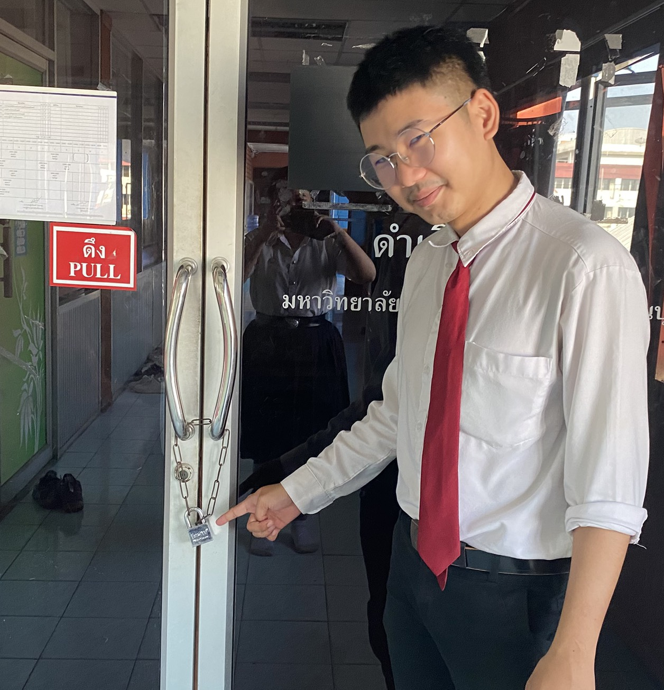

# Physical Controls ในชีวิตประจำวัน

 

+ แม่กุญแจและโซ่คล้องประตู (Padlock and Chain) ซึ่งพบตอนที่ต้องการล็อกประตูเพื่อป้องกันไม่ให้บุคคลภายนอกเข้าถึงพื้นที่ภายในอาคารหรือห้อง
+ เป็นแบบ Preventative (การป้องกัน) เพราะทำหน้าที่เป็นอุปสรรคขัดขวางหรือยับยั้งไม่ให้เกิดเหตุการณ์บุกรุกขึ้นตั้งแต่แรก โดยการจำกัดการเข้าถึงทางกายภาพ
+ เป็นแบบ Physical (ทางกายภาพ) เพราะเป็นอุปกรณ์ที่จับต้องได้จริง มีตัวตนชัดเจนในโลกแห่งความเป็นจริง และใช้คุณสมบัติทางวัตถุในการรักษาความปลอดภัย
